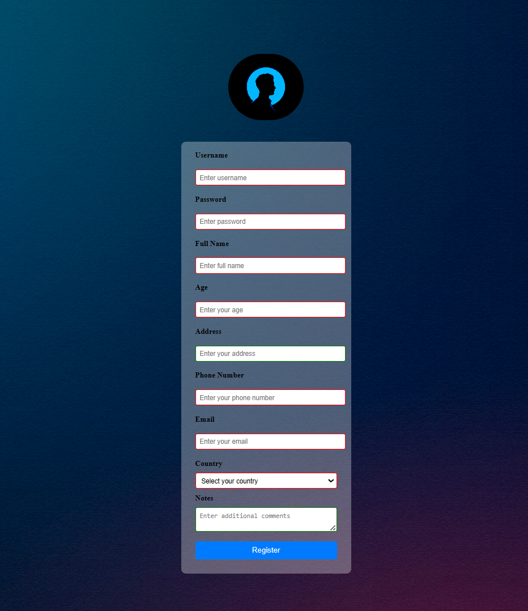

# Form — Registration Template

Overview
---
This project is a simple registration form template built with `HTML` and `CSS`. It displays a translucent form container over a background image and is a good starting point for login pages, user profile forms, or demo layouts.

Preview
---
- Open `template.html` in your browser to preview the template. The images are expected to be inside the `template_images/` folder.

Repository Structure
---
- `template.html`: Main HTML file containing the registration form.
- `template.css`: CSS styles for the background, translucent form container, and form controls.
- `template_images/`: Images used by the template (background, profile image, etc.).

Usage
---
1. Make sure all files are in the same folder (as provided).
2. Open `template.html` in a web browser (double-click or `Open with -> Browser`).
3. Edit `template.html` and `template.css` to change fields, labels, styles, or images.

Quick Tips & Customization
---
- For RTL (Arabic) support, set `dir="rtl"` and `lang="ar"` on the `<html>` element in `template.html`.
- The image URLs in `template.css` currently use absolute-style paths like `/template_images/...`. If you open the file locally and images do not load, change them to relative paths: `template_images/background.jpg` and `template_images/profile.jpg`.
- To change button color or input appearance, edit `input[type="submit"]` and `input, select, textarea` rules in `template.css`.

Notes
---
- This template is intended as an educational starter and can be extended with form validation, submission handling, or integration with CSS frameworks.

Author
---
MohamedALNatsha

License
---
You are free to use and modify this template. Add a `LICENSE` file if you want to apply a specific license.

